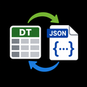

<div align="center">



# DataTable Mirror

<a href="https://github.com/DCode1119/DataTableMirror/releases">
  
</a>
<a href="LICENSE">
  
</a>


**An Unreal Engine editor plugin that automatically mirrors DataTable assets to JSON on save, with a headless commandlet for CI/CD pipelines.**

</div>

---

## Features

- **Auto-export on save** — Every DataTable save writes a human-readable, diffable JSON mirror to disk. No manual steps, no forgotten exports.
- **Configurable** — Output directory and auto-export toggle are adjustable via Project Settings.
- **Console command** — `DataTableMirror.GenerateMissingJson` scans all project DataTables and exports any that are missing their JSON mirror.
- **Commandlet** — Run headlessly from the command line or CI/CD pipeline for bulk export.

---

## Installation

Clone into your project's `Plugins/` directory:

```bash
git clone https://github.com/DCode1119/DataTableMirror.git Plugins/DataTableMirror
```

Or add as a submodule:

```bash
git submodule add https://github.com/DCode1119/DataTableMirror.git Plugins/DataTableMirror
```

Regenerate project files, rebuild, and enable the plugin in **Edit > Plugins > DataTable Mirror**.

---

## Usage

### Auto-export (default)

Save any `DataTable` asset in the editor. The plugin writes a `.json` mirror to the configured output directory automatically.

### Console command

Open the editor console (<kbd>~</kbd>) and run:

```
DataTableMirror.GenerateMissingJson
```

This is useful when you first enable the plugin and need to backfill JSON files for existing DataTables.

### Commandlet (CI/CD)

```batch
UnrealEditor-Cmd.exe YourProject.uproject -Run=DataTableMirrorCommandlet -Log
```

The commandlet scans all DataTable assets in the project, exports any that lack a JSON mirror, and returns exit code `0` on success.

---

## Configuration

Navigate to **Edit > Project Settings > Plugins > DataTable Mirror**.

| Setting | Default | Description |
|---|---|---|
| `OutputDirectory` | `Data/JSON` | Directory relative to project root where JSON files are written |
| `bAutoExportOnSave` | `true` | Enable or disable the automatic export on save |

Settings persist in `<Project>/Config/DefaultDataTableMirror.ini`.

---

## Documentation

Full documentation is available in the [`Docs/`](Docs/) directory:

| Guide | Description |
|---|---|
| [Getting Started](Docs/) | Installation, requirements, verification |
| [Usage](Docs/usage.md) | Auto-export, console command, project settings |
| [CI/CD Integration](Docs/ci-cd.md) | Commandlet usage in pipelines |
| [FAQ](Docs/faq.md) | Troubleshooting and common questions |

---

## Output Format

JSON mirrors are written as an array of row objects. Each row includes a `"Name"` field followed by the row's data fields.

```json
[
  {
    "Name": "Head",
    "ConsciousnessCoefficient": 2.0,
    "WillCoefficient": 0.5,
    "VitalityCoefficient": 0.3
  },
  {
    "Name": "Torso",
    "ConsciousnessCoefficient": 0.5,
    "WillCoefficient": 0.8,
    "VitalityCoefficient": 1.5
  }
]
```

---

## Why?

Unreal Engine DataTables are stored as binary UAsset files — terrible for version control diffs. JSON mirrors give you:

- **Readable diffs** in pull requests.
- **Quick scanning** of DataTable contents without opening the editor.
- **CI/CD validation** — compare committed JSON against the live DataTable to catch drift.

---

## Requirements

- Unreal Engine 5.1+ (Tested up to 5.7)
- Editor module — not available in runtime builds

> **EngineVersion warning**: The plugin declares `"EngineVersion": "5.1.0"` for
> broad compatibility. If you see a version mismatch warning in your build log,
> it is safe to ignore — or update `EngineVersion` in `.uplugin` to match your
> local engine version.

---

## License

[MIT](LICENSE)
